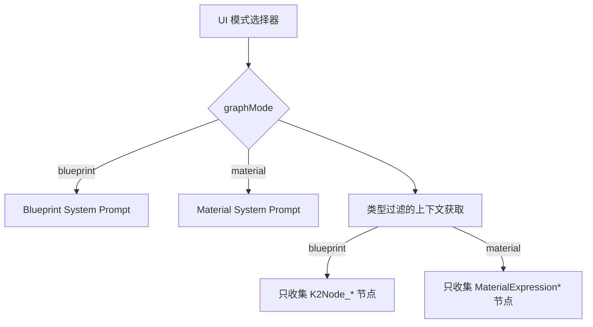

# Blueprint / Material 模式分离方案

## 1. 问题背景

当前生成模式存在以下问题：

1. **System Prompt 混杂**：生成蓝图和材质使用相同的 prompt，导致材质生成质量差、格式错误
2. **上下文污染**：`_getBlueprintContext()` 不区分节点类型，材质生成时可能拿到蓝图节点作为参考
3. **用户预期不匹配**：用户需要明确知道当前处于哪种编辑模式

---

## 2. 方案概述

> [!IMPORTANT]
> 核心思路：引入 **Graph Type 模式切换**，实现 Blueprint 和 Material 的完全隔离



---

## 3. 交互设计

### 3.1 模式切换器 UI

在 AI Panel 的 **工具栏区域** 添加一个显眼的模式按钮组：

```
┌─────────────────────────────────────────────┐
│ [⚙] [×]                                     │ ← 标题栏
├─────────────────────────────────────────────┤
│                                             │
│              (聊天历史区)                    │
│                                             │
├─────────────────────────────────────────────┤
│ [ 🔷 Blueprint ] [ 🎨 Material ]            │ ← **新增：模式按钮组**
│ ┌─Model Select─┐                            │
│                                             │
│ ┌───────────────────────────────────────┐  │
│ │ Prompt...                             │  │
│ └───────────────────────────────────────┘  │
│ [ Chat ] [ Generate ]              [➤]     │ ← 操作模式（不变）
├─────────────────────────────────────────────┤
│ Status: Ready                               │
└─────────────────────────────────────────────┘
```

### 3.2 视觉区分

| 模式 | 按钮样式 | 状态栏提示 | 默认占位文本 |
|------|----------|-----------|--------------|
| Blueprint | 蓝色高亮 `#4a7c8c` | "Blueprint Mode" | "Describe event/logic..." |
| Material | 紫色高亮 `#7c4a8c` | "Material Mode" | "Describe shader effect..." |

### 3.3 自动模式检测（可选增强）

当用户粘贴节点或加载内容时，自动检测首个节点类型：
- 若检测到 `MaterialExpression*` → 建议切换到 Material 模式
- 若检测到 `K2Node_*` → 建议切换到 Blueprint 模式

以 toast 或状态栏提示：`"检测到材质节点，是否切换到 Material 模式？"` [切换] [忽略]

---

## 4. 技术实现要点

### 4.1 新增 graphMode 属性

```javascript
// AIPanelElement.js
static properties = {
    // ...existing properties
    graphMode: { type: String }  // "blueprint" | "material"
}

constructor() {
    // ...
    this.graphMode = "blueprint"  // 默认为蓝图模式
}
```

### 4.2 上下文过滤逻辑

修改 `_getBlueprintContext()` 关键改动：

```javascript
_getBlueprintContext() {
    if (!this.blueprint) return null

    let nodes = this.blueprint.getNodes(true)
    if (nodes.length === 0) {
        nodes = this.blueprint.getNodes(false)
    }

    // 新增：根据 graphMode 过滤节点类型
    nodes = nodes.filter(n => {
        const type = n.entity.getBlueprintType()
        if (this.graphMode === "material") {
            return type === "MATERIAL"
        }
        // blueprint 模式排除 material 节点
        return type === "BLUEPRINT"
    })

    // ... 序列化
}
```

### 4.3 System Prompt 切换

新增 `prompts.js` 导出：

```javascript
export const BLUEPRINT_SYSTEM_PROMPT = `...现有内容...`

export const MATERIAL_SYSTEM_PROMPT = `You are an expert Unreal Engine 5 Material developer. 
Your task is to generate valid T3D format Material nodes...

### Material Node Structure
- Outer: MaterialGraphNode (wrapper)
- Inner: MaterialExpression* (actual node)
- Connections use: A=(Expression="...")

### Common Material Nodes
- MaterialExpressionAdd
- MaterialExpressionMultiply  
- MaterialExpressionTextureSample
- ...
`
```

### 4.4 LLMService 调用时选择 Prompt

```javascript
// _handleGenerate
const systemPrompt = this.graphMode === "material" 
    ? MATERIAL_SYSTEM_PROMPT 
    : BLUEPRINT_SYSTEM_PROMPT
```

---

## 5. 对现有功能的影响

| 功能 | 影响 | 处理方式 |
|------|------|---------|
| Chat 模式 | 低 | 上下文也按 graphMode 过滤 |
| Generate 模式 | 核心受益 | 隔离的 prompt + context |
| 节点粘贴 | 无影响 | 粘贴行为不变，只影响 AI 上下文 |
| 设置面板 | 可选增强 | 可保存偏好的默认模式 |

---

## 6. 未来扩展

- **Niagara 模式**：添加 `niagara` graphMode，处理粒子系统节点
- **PCG 模式**：程序化生成图节点
- **多模式组合**：允许同时选中多种类型（高级用户）

---

## 7. 替代方案对比

| 方案 | 优点 | 缺点 |
|------|------|------|
| **A. 独立模式按钮（推荐）** | 清晰、显式、用户可控 | 需要用户手动切换 |
| B. 自动检测当前画布 | 无需手动操作 | 混合场景难处理 |
| C. 每次生成时弹窗询问 | 不会做错选择 | 打断工作流 |

**推荐方案 A**：清晰的模式切换器，配合可选的自动检测提示。

---

## 8. 决策点

> [!IMPORTANT]
> 需要用户确认的设计决策

1. **默认模式**：新建画布时默认 Blueprint 还是根据首个粘贴节点决定？
2. **模式持久化**：是否保存用户上次选择的模式？
3. **混合警告**：在 Material 模式下检测到 Blueprint 节点时是否警告？
4. **UI 位置**：模式按钮放在工具栏顶部还是输入框附近？

---

## 9. 下一步

1. 用户确认方案后，开始实现
2. 优先完成核心隔离（prompt + context 过滤）
3. UI 按钮切换
4. 可选：自动检测增强
