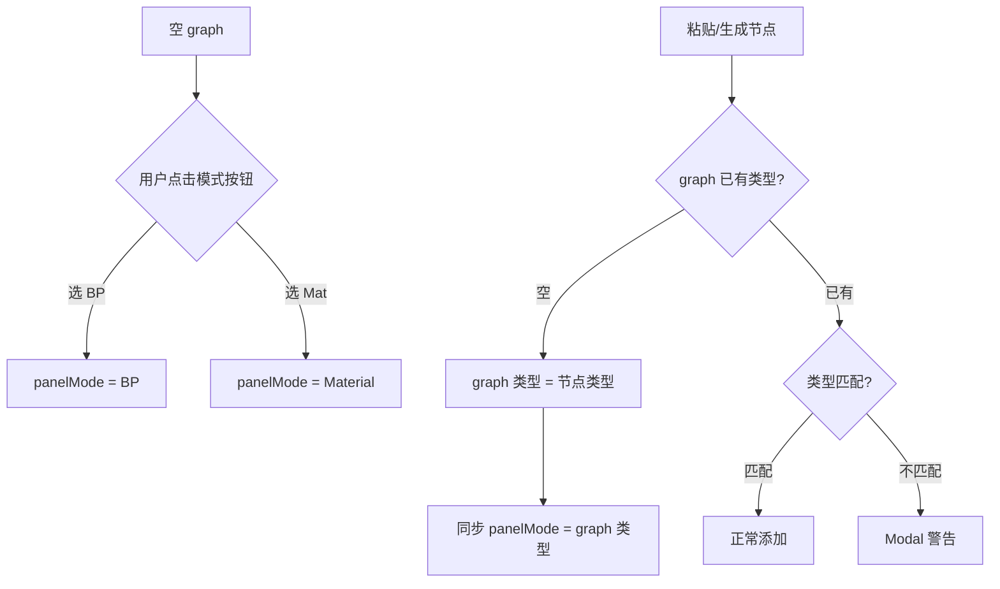

# Blueprint / Material 模式分离方案

## 1. 问题背景

1. **Graph 已有类型感知**：右下角显示 BLUEPRINT / MATERIAL（由首个节点决定）
2. **缺少类型冲突校验**：允许混合添加不同类型节点
3. **AI 生成不感知类型**：System Prompt 只有 Blueprint 版本

---

## 2. 确认的设计决策

| 决策点 | 选择 |
|--------|------|
| 警告方式 | **Modal 对话框**（阻断确认） |
| 空 graph 默认类型 | **需要用户选择**（面板显示模式按钮） |
| 批量粘贴警告 | **一次性警告**（不逐个提示） |
| 新 Tab 切换模式 | **延后实现**（验证现有设计后再评估） |

---

## 3. 交互设计

### 3.1 模式切换按钮

在 AI Panel 工具栏添加 **BP / Material 模式按钮**：

```
┌─────────────────────────────────────────────┐
│ [ 🔷 BP ] [ 🎨 Mat ]          [⚙] [×]      │ ← 模式按钮 + 设置/关闭
├─────────────────────────────────────────────┤
│              (聊天历史区)                    │
├─────────────────────────────────────────────┤
│ ┌─Model Select─┐                            │
│ ┌───────────────────────────────────────┐  │
│ │ Prompt...                             │  │
│ └───────────────────────────────────────┘  │
│ [ Chat ] [ Generate ]              [➤]     │
└─────────────────────────────────────────────┘
```

### 3.2 模式切换行为

| 场景 | 行为 |
|------|------|
| Graph 为空 | 直接切换，无警告 |
| Graph 已有内容 | 弹出 Modal 警告 |
| 模式与 graph 类型一致 | 正常切换/保持 |

### 3.3 类型冲突 Modal

**场景 A：切换模式时 graph 已有内容**

```
┌─────────────────────────────────────────────────┐
│  ⚠️  Switch Mode?                               │
│                                                 │
│  Current graph contains Blueprint nodes.        │
│  Switching to Material mode may cause issues.   │
│                                                 │
│  [ Cancel ]              [ Switch Anyway ]      │
└─────────────────────────────────────────────────┘
```

**场景 B：粘贴/生成类型不匹配的节点**

```
┌─────────────────────────────────────────────────┐
│  ⚠️  Type Mismatch                              │
│                                                 │
│  You're adding 3 Material nodes to a Blueprint  │
│  graph.                                         │
│                                                 │
│  [ Cancel ]              [ Add Anyway ]         │
└─────────────────────────────────────────────────┘
```

### 3.4 模式状态同步



---

## 4. 技术实现要点

### 4.1 新增属性

```javascript
// AIPanelElement.js
static properties = {
    // ...existing
    graphMode: { type: String }  // "blueprint" | "material"
}

constructor() {
    this.graphMode = "blueprint"  // 默认蓝图模式
}
```

### 4.2 模式切换处理

```javascript
_handleGraphModeChange(newMode) {
    // 检查当前 graph 是否有不同类型的节点
    if (this.blueprint?.nodes?.length > 0 
        && this.blueprint.blueprintType 
        && this.blueprint.blueprintType !== this._modeToType(newMode)) {
        // 显示 Modal 警告
        this._showModeConflictModal(newMode)
    } else {
        this.graphMode = newMode
    }
}

_modeToType(mode) {
    return mode === "material" ? "MATERIAL" : "BLUEPRINT"
}
```

### 4.3 添加节点时的类型校验

```javascript
// Blueprint.js addGraphElement() 中
const newType = element.entity.getBlueprintType()
if (this.blueprintType && newType !== this.blueprintType) {
    const event = new CustomEvent('ueb-type-mismatch', {
        detail: { currentType: this.blueprintType, newType, nodes: [element] },
        bubbles: true, cancelable: true
    })
    if (!this.dispatchEvent(event)) {
        return  // 事件被取消，不添加节点
    }
}
```

### 4.4 批量粘贴一次性警告

```javascript
// 在 paste handler 中收集所有类型不匹配的节点
const mismatchedNodes = nodesToAdd.filter(n => 
    this.blueprintType && n.entity.getBlueprintType() !== this.blueprintType
)
if (mismatchedNodes.length > 0) {
    // 一次性警告，显示数量
    showModal(`Adding ${mismatchedNodes.length} ${newType} nodes to ${this.blueprintType} graph`)
}
```

---

## 5. 修改文件清单

| 文件 | 修改内容 |
|------|----------|
| `js/ai/AIPanelElement.js` | 添加 graphMode 属性、模式按钮 UI、切换警告 |
| `js/ai/prompts.js` | 新增 `MATERIAL_SYSTEM_PROMPT` |
| `js/ai/LLMService.js` | `generate()` 接受动态 system prompt |
| `js/Blueprint.js` | `addGraphElement()` 类型校验 + 事件 |
| （可选）新增 Modal 组件 | 或复用现有 confirm 逻辑 |

---

## 6. 延后实现

> [!NOTE]
> 以下功能验证现有设计后再评估

- **新 Tab 切换**：BP → Mat 时自动开新 graph tab
  - 实现成本：需要理解现有 tab 管理机制，可能涉及 state 持久化
  - 优先级：低，先验证单 graph 体验

---

## 7. 下一步

1. ✅ 方案确认
2. 开始实现：
   - 优先：AI Panel 模式按钮 + MATERIAL prompt
   - 然后：Blueprint.js 类型校验 + Modal 警告
